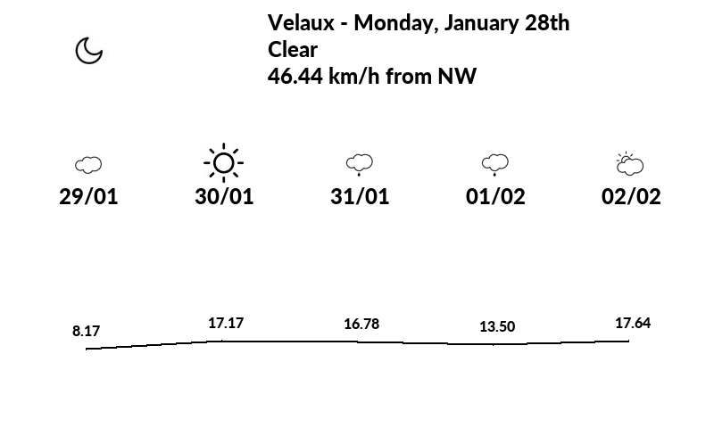

# Epaper display with RPi3

This project is a test with a [7.4" Pervasive display](http://www.pervasivedisplays.com/products/740) and the SPI interface of a Raspberry Pi 3.

Integration with [OpenWeatherMap](https://openweathermap.org).

## Steps on Raspbian

- Install Pillow requirements (see [Installation](https://pillow.readthedocs.io/en/stable/installation.html#basic-installation)) 
- Activate SPI interface with `sudo raspi-config`
- Install requirements.
- Connect pins :

| RPi Pins | Display pins |
| --- | --- |
|1 - 3.3V |VDDIN|
|2 - 5V|VIN|
|6 - GND|GND|
|12 - GPIO 18|/EN|
|16 - GPIO 23|BUSY|
|19 - GPIO 10|MOSI|
|21 - GPIO 9|MISO|
|23 - GPIO 11|SCK|
|24 - GPIO 8|/CS|
|34 - GND|GND|

- Rename `credantials_example.json` in `credentials.json` and add OpenWeatherMap API key
- Execute `python main.py`

## Example

